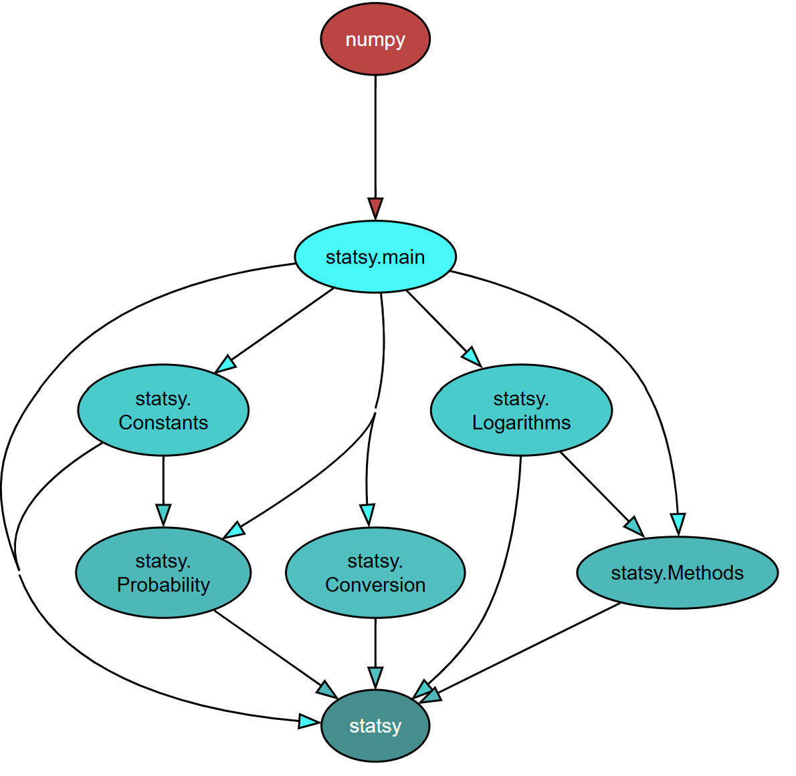

# Statsy

_**Note, this repository and the statsy package is still in development**_


[](https://opensource.org/licenses/Apache-2.0)


- [Overview](#overview)
- [Get started](#quickstart)
- [Disclaimers](#disclaimers)

## Overview

This repository contains the source code for the PyPi package Statsy. This package was built initially to track functions, operations, and methods used for statistics. It is not a production-ready package, but its components and functions may be used and repurposed.

The package is divided into several components, visualized with [pydeps](https://github.com/thebjorn/pydeps) below:




----

Although the main module imports NumPy, it is not a significant dependency. `main.py` defines a few core, frequently occuring operations such as summation notation and product notation. Most of the core statistical functions and operations are located in `Methods.py`

Currently, Statsy provides support for many standard functions in statistics (variance, standard deviation, mean, geometric mean, etc.) and probability (simple probability, joint probability, permutations, combinations, etc.).

## Quickstart

Statsy may be downloaded using pip:

```
pip install statsy
```

And imported into your code:

```
import statsy as sty

print(sty.summation(None,None,lambda x,y: x*y, [[1,2,3],[4,5,6]]))
```

Alternatively, the entire module may be imported, and the functions called directly:

```
from statsy import *

print(summation(None,None,lambda x,y: x*y, [[1,2,3],[4,5,6]]))
```


## Disclaimers
Statsy is built out of simple Python components and is not computationally optimized. Users may find libraries such as [NumPy](https://github.com/numpy/numpy), [Pandas](https://github.com/pandas-dev/pandas), [SciPy](https://github.com/scipy/scipy), and [StatsModels](https://github.com/statsmodels/statsmodels) more suitable and stable for their purposes.